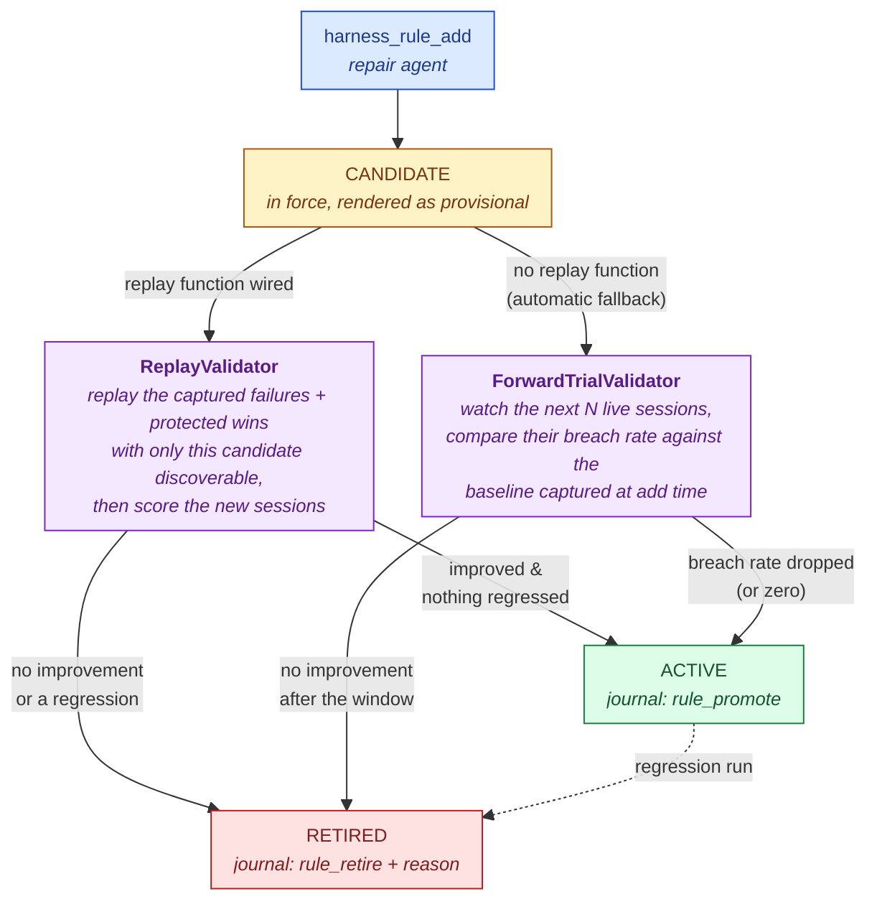

A newly written rule is a hypothesis, not a fact. [The repair agent](/harness/loop/repair-agent) records a **candidate**, and the harness gathers evidence — automatically, with no human involved — before trusting it. **Neither agent can promote a rule**; an agent that approved its own work would be a self-approving loop, which is precisely what this page exists to prevent:



Candidates render in their scope file under the *"Provisional rules (under evaluation)"* heading — a rule must be in force to be measurable — so any reader can see they are unproven. Retrieval may narrow the *active* rules in a file; it never filters candidates, because filtering a trial would starve it.

## What a replay is scored on

A replayed session is re-scored on the **trace** metrics — Tier 1 plus Tier 2 (`replay_metrics()`), against the replay's *last* trace. Between them, Tier 1 carries the outcome trajectory and Tier 2 the step-level verdict, so they cover whatever the notice can have triggered on. Tier 3 is excluded: it never triggers a breach, so re-scoring it would only add cost.

<Note>
  The metric you promote on has to be one that *discriminates*. Judging a candidate by a broad rollup barely separates a good session from a bad one, which makes the promote/retire decision close to random — so validation re-scores on the specific trace metrics the notice was about.
</Note>

## Which metric decides

A replay produces a delta per metric, and the verdict hangs on one of them. The harness picks the most authoritative metric **that this case actually measured**, in trust order:

1. **`outcome_correct`** — your [outcome verifier](/harness/closed-loop/outcome-verifier)'s verdict, if one is wired and it had an answer.
2. The rule's own declared `metric`.
3. The metric named in the triggering signature.

Falling back down the list is deliberate: a verifier that cannot grade a particular task contributes no delta, and treating its absence as a failed target would veto promotion for every such case.

## Replay validation — the strong path

The PandaProbe platform is passive and trace-based: it scores traces a session already produced, so nobody can re-score the past "as if the rule had existed". Counterfactual evidence requires re-running the scenario — and only you can re-run your agent. That is the [replay function](/harness/closed-loop/eval-set-and-replay#the-replay-function):

```python
harness = Harness.create(replay=my_replay_fn)
```

When a candidate lands and a matching, replayable [eval case](/harness/closed-loop/eval-set-and-replay) exists, the `ReplayValidator`:

1. Selects the newest failing cases whose signatures match the candidate (up to 3), plus up to 2 protected `win` cases to catch collateral damage.
2. Builds a **capability-only** context — no rule bodies, no index — in which **only this candidate is discoverable**. Active rules stay visible as the baseline being measured against; other provisional candidates are hidden. Then calls your replay function per case, sequentially and time-bounded.
3. Scores each returned session's last trace on the trace metrics, directly through the evaluator (never through the live turn pipeline).
4. **Promotes** iff the targeted metric improved past `rule_promote_margin` on a failing case and nothing regressed attributably. Otherwise **retires**, with the exact reason and per-case deltas journaled.

Inconclusive rounds are evidence of nothing: the candidate stays pending, its `replay_attempts` advances, and after `3` attempts validation relies on the forward trial instead.

### Attribution

Two rules keep a verdict answerable for the candidate rather than for its surroundings:

- **The candidate must actually be read.** A replay that never called a rule tool cannot produce a conclusive verdict — whatever moved, this rule did not move it. The case counts as inconclusive instead.
- **Only attributable regressions retire.** On a *failure* case, a drop retires the candidate when it lands on the candidate's own target metric family or on the authoritative `outcome_correct`. A dip in some unrelated judged metric is recorded in telemetry but is not treated as causation. A protected `win` case is exempt from that narrowing: a win is the collateral-damage guard, so *any* metric regressing there is the signal it exists to catch.

<Warning>
  This narrowing matters more than it sounds. In one measured run, **44% of retirements had fired on a metric the rule never claimed** — most of them `coherence` drops of under 0.1, which is noise-scale against a natural spread of ~0.15. Those rules were discarded for someone else's variance.
</Warning>

### Every candidate gets a verdict

Replays are sequential and slow, and candidates accrue faster than replays decide them. Left alone, the newest candidates are never reached — in one run, six candidates sat with `replay_attempts=0` and no verdict at all, two of which had already earned promotion.

So a round is bounded by `validation_round_budget_s` and rotates which candidate replays first. Past the budget, remaining candidates still get a decision — the cheap forward-trial one — rather than none.

Where a replay must first acquire a shared environment (one server, one container, one device), queueing would otherwise consume the execution budget and time out having run nothing. Signal arrival with `ReplayContext.mark_execution_started()` and `replay_env_wait_timeout_s` covers the wait while `replay_timeout_s` starts fresh for the actual run.

## Forward trials — the automatic fallback

Without a replay function, nothing breaks and nothing is silently faked: the fallback is announced once (log + a `validation` journal event) and validation turns statistical.

- **Baseline, captured at add time:** the fraction of recently-journaled sessions whose notices matched the rule's metric family (any condition — `stall:`, `regression:`, `breach:` — on the rule's metric). With no history the baseline is `1.0` — the rule was authored against a live failure, so assume it was firing.
- **Trial:** every handled report — healthy or alerting — enrolls its session (up to `rule_trial_min_sessions`, default 5, distinct sessions) and records whether that session showed the target condition while the candidate was in force.
- **Verdict:** promote when the trial breach rate is `0`, or improved on the baseline by at least `rule_promote_margin`; otherwise retire.

<Note>
  The baseline denominator only sees sessions that journaled an incident, which biases it *high* — making the forward trial lenient about promotion, never about retirement. Replay remains the strong evidence path; wire one if you can.
</Note>

## How validation runs

You never call the validators yourself in normal operation. The hook feeds every handled report into the validation engine and kicks a **single-flight** background round — validation never blocks a turn, never touches the live evaluation bookkeeping, and any failure inside it degrades to a log line.

`settle()` deliberately does **not** wait for a round: a replay can need the very resource the current turn holds — an environment lock, a world, a container — so awaiting it inside a per-turn barrier could deadlock until the replay times out.

At a **phase boundary**, where nothing is held, run it to a standstill:

```python
settled = await harness.settle_validation(timeout=600)   # -> bool
```

Call this before you snapshot, archive, or report a ruleset. Waiting on evaluations alone lets you capture a state in which a candidate that had already earned promotion is recorded as permanently provisional.

For tests, scripts, and deterministic pipelines:

```python
verdicts = await harness.validate_candidates()          # run one round now
drained = await harness.drain_validation(timeout=60)    # -> bool: did it finish?
harness.validation_pending                              # rounds still in flight
```

## Observing the lifecycle

Every transition is journaled with its evidence, and the agent can ask directly:

```python
status = await harness.task_tools.call("harness_rule_status", {"rule_id": "r-23b0460306"})
# {
#   "ok": true,
#   "rule": {..., "status": "active"},
#   "lifecycle": {
#     "status": "active",
#     "baseline_rate": 1.0, "trial_rate": 0.0,
#     "sessions_observed": 5, "sessions_needed": 5,
#     "replay_attempts": 0,
#     "verdict": "promoted:replay: tool_correctness improved past margin..."
#   }
# }
```

Every promote and retire is also a journal event with its reason, and `rule_retire` carries the structured evidence — the per-case deltas that decided it — rather than only prose.

A round emits five event types, so an artifact can explain a pending state as well as a terminal one:

```python
harness.journal.recent(types=("validation_verdict", "validation_round_finished"))
```

| Event | Carries |
| --- | --- |
| `validation_round_started` | Queued candidate ids, the round budget. |
| `validation_candidate_started` | Which validator, `replay_attempts`, sessions observed vs. needed. |
| `validation_replay_case` | Case id and kind, replay session, **whether the candidate was read**, wait vs. execution time, deltas, outcome. |
| `validation_verdict` | Outcome, validator, reason, and a closed-set `pending_reason`. |
| `validation_round_finished` | Decided vs. pending counts, promotions, retirements, whether the budget was exhausted. |

`pending_reason` is one of `trial_in_progress`, `no_matching_replayable_case`, `replay_inconclusive`, `candidate_not_exercised`, `env_wait_timeout`, or `round_budget_exhausted` — so "no verdict yet" is always distinguishable from "never attempted".

## Configuration

| Knob | Default | Meaning |
| --- | --- | --- |
| `rule_validation` | `true` | The candidate lifecycle. **Required** for mutating `Harness` construction, so a repair-authored rule can never skip the evidence gate. |
| `rule_trial_min_sessions` | `5` | Distinct live sessions a forward trial observes before a verdict. |
| `rule_promote_margin` | `0.05` | Minimum improvement of the targeted metric to promote. |
| `rule_regress_margin` | `0.05` | Maximum tolerated drop on any other case/metric. |
| `replay_timeout_s` | `300` | Hard bound on one replay's **execution** — a hung replay degrades to inconclusive, never wedges validation. |
| `replay_env_wait_timeout_s` | `0` | Grace for a replay to acquire a shared environment before the execution budget starts. `0` keeps a single combined budget. |
| `validation_round_budget_s` | `0` | Replay work allowed per round; past it, candidates get the forward-trial verdict. `0` is unlimited. |
