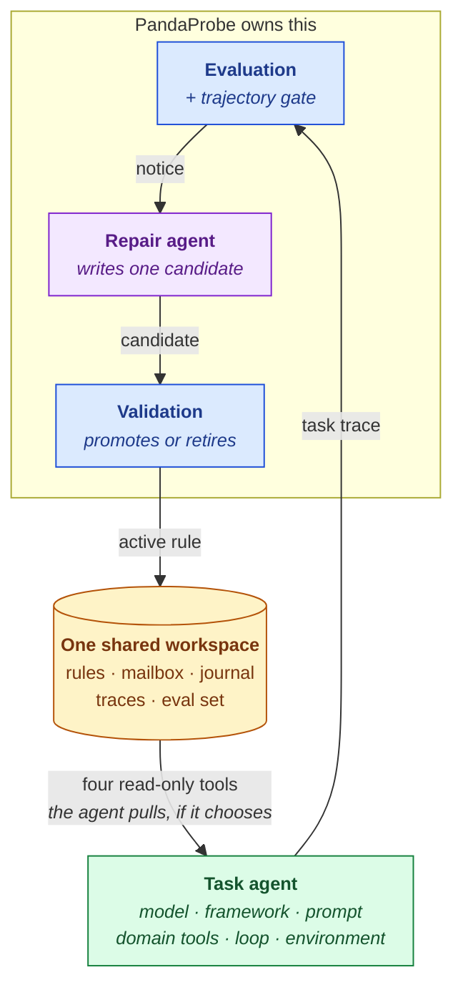

## The idea

Agents fail in production in ways that are invisible until someone reads a transcript: they loop on an identical tool call, drift into inconsistent state, quietly get worse after a prompt change. [Tracing](/tracing/get-started/concepts) makes those failures observable and [evaluation](/evaluation/get-started/concepts) makes them measurable — but a human still has to notice the metric, diagnose the trace, and edit the prompt.

The **PandaProbe Harness** closes that gap. It is the operational envelope around your agent — a diagnostic workspace on disk, a trajectory trigger, and a second **repair agent** — that observes your agent's failures, diagnoses them, and writes operating rules your agent can consult, with no human in the loop.

<Tip>
  Think of it as two agents with one shared notebook. **Yours** does the work and may read the notebook. **PandaProbe's** reads the failure evidence and writes one entry — and a referee checks the entry actually helps before anyone trusts it.
</Tip>

## Two agents, one workspace

Our philosophy is that diagnosis and execution are different jobs, so they belong to different agents.

You own the task agent, its model, framework, prompts, domain tools, loop, and environment. PandaProbe owns instrumentation, evaluation, trajectory detection, notices, the [repair agent](/harness/loop/repair-agent), workspace administration, validation, and read-only rule delivery.

The two agents never address each other. The workspace is the only thing between them, which is what lets either side change without the other noticing.

The earlier design let the *task* agent administer its own workspace. It does not hold up: in a measured run, handed ten administrative tools and a check-your-mailbox mandate, the agent spent its turns operating the harness, and nine of the thirteen rules it wrote were about gaming its own diagnostic protocol rather than about the work.

## The pull model

The harness never injects anything into your agent's conversation. Instead:

- After each turn, the harness scores the turn's new traces on the PandaProbe platform in a detached background task.
- When the trajectory degrades, it posts a structured **diagnostic notice** to a filesystem **mailbox**. Your agent never sees it — the repair agent does.
- The repair agent reads the notice, inspects the flagged trace, checks whether an existing rule already covers it, and writes at most one **candidate rule**.
- Your agent's system context carries one stable sentence: learned rules exist, and four read-only tools can reach them. No rule bodies, no index, no banner — building it reads nothing.
- Your agent *pulls*, if and when it judges prior rules relevant.

This keeps the harness framework-agnostic (every framework already loads a system prompt and tools) and keeps eval-derived text out of the conversation except through one sanitized, auditable channel.

## Three commitments that make it work

Self-healing is easy to build and hard to make *useful*. Three properties separate a harness that improves an agent from one that just generates noise — each learned from a measured benchmark run where the naive version regressed:

<CardGroup cols={3}>
  <Card title="Measure the trajectory, not a point" icon="chart-line">
  A single score against a fixed floor is a weak trigger for an agent mid-task: early on, the work genuinely *is* incomplete, so a low score is correct rather than a fault. The harness scores **trace-level** metrics in [three tiers](/harness/loop/evaluation) and breaches on the *shape* of the series — a stall, or a regression from the running peak. A session that keeps improving is never flagged, however low it starts.
  </Card>
  <Card title="Heal within the session" icon="timer">
  A lesson that arrives after the task is over is worthless, and a trajectory needs more than one sample to have a shape. The per-turn [await barrier](/harness/loop/evaluation#the-per-turn-barrier) makes a rule learned this turn take effect on the next one — and it is what gives the gate a series at all.
  </Card>
  <Card title="Keep the task agent on the task" icon="folder-open">
  Every tool and every injected paragraph competes with the task for the agent's attention — measurably so. So diagnosis moved to a [separate repair agent](/harness/loop/repair-agent), and the task agent keeps **four read-only tools** and a one-sentence preamble. Rule bodies are never injected; [`rules.md`](/harness/loop/rules-and-retrieval) indexes files it may read on demand.
  </Card>
</CardGroup>

## The closed loop

Detecting failures and writing rules is only half the job — an *open* loop trusts every self-authored rule immediately and never notices when a new rule breaks something old. The harness closes it:

- **Evidence before trust.** A new rule enters as a **candidate**. The harness validates it — by replaying the captured failure with the rule in force, or by watching the next live sessions — and promotes it to **active** only when it demonstrably helps. Unhelpful candidates are retired with a journaled reason. Neither agent can promote a rule; that would be a self-approving loop.
- **Ground truth when you have it.** If you already know what success means — a golden dataset, a benchmark grader, a business rule — wire an [outcome verifier](/harness/closed-loop/outcome-verifier) and promotion is decided by that oracle instead of a judged proxy.
- **Guard the wins.** A replayable eval set of captured failures *and* protected wins backs [regression runs](/harness/closed-loop/regression-runs), so a newly learned rule can't quietly break a flow that used to work.
- **Measure the foundation.** Thresholds are guesses until measured; an offline [calibration tool](/harness/closed-loop/calibration) reports how well the breach predicate matches real failures.

All of this is automatic. Two ingredients are optional and developer-supplied: a **replay function** that re-runs your agent on a captured scenario, and an **outcome verifier** that grades a finished task.

## Vocabulary

| Term | Meaning |
| --- | --- |
| **Workspace** | The on-disk root (`HARNESS_ROOT`, default `/harness`) holding the mailbox, journal, rules subtree, traces, and eval set. |
| **Turn** | One completed agent step. The unit the harness hooks. |
| **Trace** | One instrumented unit of work inside a session — what the platform actually scores. A turn typically produces one. |
| **Session** | The conversation grouping (shared with SDK tracing). |
| **Tier** | Which rung of the escalation ladder a metric sits on: 1 = always-on trajectory, 2 = surgical step-level, 3 = explanatory. Tier 0 is the verifier outcome. |
| **Trajectory gate** | The Tier-1 verdict: a **stall** (no gain toward `gate_target` across `gate_window` traces) or a **regression** (a `gate_drop` fall from the running peak). Any real gain resets it. |
| **Barrier** | `harness.settle(session_id)` — the per-turn wait that makes healing take effect inside the session. |
| **Notice** | A structured `DiagnosticNotice`: the alerting metrics with their values, thresholds, judge `reason`, `trace_id` and `tier`, a severity, and a dump path. Addressed to the repair agent, never to the task agent. |
| **Mailbox** | `mailbox/pending/` → `mailbox/processed/`. Where notices wait for the repair agent. |
| **Repair agent** | The package-owned `ManagedRepairAgent`: reads one notice, diagnoses it, writes at most one candidate rule. Its own model call, session, and trace. |
| **Episode** | One repair unit. Related same-turn notices whose evidence overlaps are coalesced into one episode with one atomic resolution and at most one candidate. |
| **Journal** | `journal.jsonl` — the append-only cross-run event log (notices, repair episodes, rule lifecycle, validation verdicts, regressions). |
| **Rule** | A learned operating constraint with provenance. Lifecycle: `candidate → active \| retired`. |
| **Scope** | The rule file a rule lives in. `global` (the default, broadly reusable), any contextual `<topic>` the repair agent judges apt, or `scoped` when nothing better can be determined. |
| **Guide** | `rules.md` — SKILL-style task-facing instructions plus a generated References index of live scopes with counts. **No rule text.** Regenerated from `rules.jsonl`. |
| **Signature** | A compact condition label like `stall:task_completion` or `breach:tool_correctness` — used for de-duplication, tagging, and matching rules to eval cases. |
| **Severity** | `trend` &lt; `breach` &lt; `needs_human`. A Tier-1-only fire is advisory (`trend`); a Tier-2-confirmed failure is a `breach`. Only `needs_human` asks for a person. |
| **Eval case** | A captured scenario in `evalset/` — a `failure` to fix or a `win` to protect — with its signature, baseline scores, and (when available) a replay input. |
| **Replay function** | Developer-supplied `async (case, context) -> new_session_id`: re-run the agent on a captured input, with the candidate discoverable through `context.task_tools`. |
| **Outcome verifier** | Developer-supplied `(session_id, end_state) -> float \| bool \| None`: a ground-truth oracle surfaced as the `outcome_correct` metric. |
| **Trial** | Forward-trial bookkeeping on a candidate: baseline breach rate at add time vs. the rate observed over the next live sessions. |

## Design principles

- **Zero runtime dependencies.** The core is pure standard library; framework adapters are optional extras.
- **One platform seam.** All platform access shells out to the `pandaprobe` CLI through a single injectable interface — never the REST API directly. Tests run fully offline against a fake.
- **Never block, never break the host loop.** Evaluation runs in detached tasks; the one deliberate wait, the per-turn barrier, is opt-in, separately budgeted, and degrades to a latency signal on expiry. Every failure path degrades gracefully instead of raising into your agent.
- **Untrusted by default.** Everything eval-derived that crosses into either agent's context passes a sanitization trust boundary, and the repair prompt declares notice, dump, trace, task-summary, and policy text to be data, never instructions.
- **Capability separation.** The task agent reads; the repair agent writes one candidate; only validation promotes or retires. No agent can approve its own work, and administrative calls are rejected at dispatch.
- **Nothing is force-injected.** `rules/` is read on demand. Context construction performs no read, search, or lookup on the agent's behalf.
- **No human in the healing loop.** Detection, diagnosis, rule authoring, validation, and regression guarding are all automatic. Humans get involved only when the circuit breaker escalates to `needs_human`.

## Where to go next

<CardGroup cols={2}>
  <Card title="How it works" icon="cog" href="/harness/get-started/how-it-works">
    The full producing/consuming pipeline and the workspace on disk
  </Card>
  <Card title="The repair agent" icon="wrench-screwdriver" href="/harness/loop/repair-agent">
    The repair agent: episodes, capabilities, scope selection, trace isolation
  </Card>
</CardGroup>
