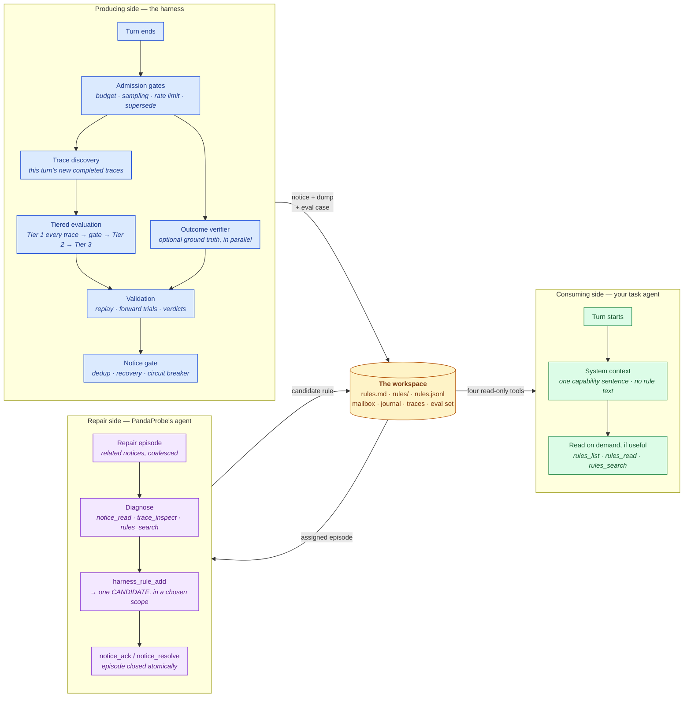

The harness has three sides. The **producing side** runs after every turn and detects failures. The **repair side** — a package-owned agent — diagnoses one failure and writes one candidate rule. The **consuming side** is your task agent, which may read what was learned. The workspace on disk is the only thing connecting them; nothing is ever pushed into a conversation.



The loop closes back through the workspace: the candidate the repair agent writes lands in the rule store, validation proves (or retires) it, and the **per-turn barrier** makes sure the detection and repair have landed before your agent's next turn begins.

## The producing side, step by step

1. **Turn end.** Your loop (or a framework adapter) calls `on_turn_end` with the session id and turn payload. This returns immediately — nothing on this path blocks your agent.
2. **Admission gates.** Cheap producer-side controls run first: a hard per-process eval budget, per-session turn sampling, and a per-session rate limit. A newer turn *supersedes* the session's in-flight evaluation.
3. **Trace discovery.** A background task lists the session's completed traces (newest-first from the platform, replayed oldest-first) and keeps a per-session seen-set, so each turn scores only what is new.
4. **Tiered evaluation.** Tier 1 scores every new trace in one batched run and folds each into the trajectory gate; a gate breach escalates to Tier 2 on the last trace only; a confirmed Tier-2 breach may pull in Tier 3. See [Evaluation & detection](/harness/loop/evaluation).
5. **Outcome verification.** If you wired a [verifier](/harness/closed-loop/outcome-verifier), it runs *alongside* the tier ladder (it depends only on the turn payload, so stacking its latency after the ladder would be wasteful) and contributes a synthetic `outcome_correct` score.
6. **Validation cadence.** Every handled report — healthy or not — feeds the candidate-rule validation engine: forward trials get their denominator, and a single-flight task evaluates open candidates. See [Rule validation](/harness/closed-loop/rule-validation).
7. **Notice gate.** Identical conditions are de-duplicated per session, recoveries are journaled, and a circuit breaker escalates notice storms to a single `needs_human`.
8. **Persistence.** A surviving condition becomes a `DiagnosticNotice` in `mailbox/pending/`, a verbose dump under `traces/`, and a journal event — and, when the severity is `breach` and capture is enabled, a replayable **eval case**.

## The repair side

Inside the same `settle()` call, the [repair agent](/harness/loop/repair-agent) picks up what the producing side posted:

1. **Episode assembly.** Related notices from the same session and turn — those whose trace or signature evidence overlaps — are coalesced into one episode. One underlying failure gets one diagnosis, not three.
2. **Bounded diagnosis.** A package-owned tool loop reads the notice, inspects a trace that notice named, and searches existing rules for prior coverage. It runs on its own model, its own session, and its own trace, so repair activity is never scored as task activity.
3. **One resolution.** The episode ends with at most one candidate rule (`harness_rule_add`, including which scope it belongs in) and exactly one acknowledgement. Timeout or failure acknowledges nothing and leaves the notice recoverable.

## The consuming side

`harness.system_context(session_id)` returns one stable sentence to prepend to your system prompt: learned rules exist, and four read-only tools can reach them. That is all — no rule bodies, no scope index, no notice count. Building it reads nothing from the workspace, so no eval-derived text can reach a task prompt automatically.

Your agent acts, if it chooses to, through the [task toolset](/harness/loop/agent-toolset): four read-only operations, delivered natively in Anthropic, LangChain, or OpenAI tool format.

## The workspace on disk

Everything the harness knows lives under one directory — inspectable, greppable, and durable across process restarts:

```text
/harness/                            (HARNESS_ROOT)
├── rules.jsonl                      # THE SOURCE OF TRUTH (latest record per id wins)
├── rules.md                         # generated task-facing guide + References index
├── rules/                           # generated scope files — read on demand, never pushed
│   ├── global.md                    #   the default: broadly reusable rules
│   ├── <topic>.md                   #   a context the repair agent judged apt
│   └── scoped.md                    #   specific rules with no better name
├── scope_metadata.json              # bounded per-scope descriptions for the index
├── mailbox/
│   ├── pending/<notice-id>.json     # posted by the hook, claimed by the repair agent
│   ├── processed/<notice-id>.json   # resolved notices, with their resolution
│   └── status.json                  # cheap summary for operators
├── journal.jsonl                    # append-only cross-run event log
├── evalset/<case-id>.json           # replayable eval cases (failures + protected wins)
├── traces/
│   ├── latest_eval.json             # most recent eval dump (always written)
│   └── <notice-id>.json             # one immutable dump per notice
└── state/score_history.json         # per-(session, metric) series + trajectory-gate state
```

All writes are atomic (unique temp file + rename) and the stores are lock-guarded, so one workspace can safely serve many concurrent sessions.

`rules.md` and everything under `rules/` are **derived views** with no authority: they are regenerated from `rules.jsonl` on every rule mutation and at startup. Delete `rules.md` and it comes back; hand-edit it and the next rule write overwrites your edit. Read them freely; change rules through the store.

## Journal event types

The journal is the harness's cross-run memory. Every notable event is one JSON line:

| Type | Written when |
| --- | --- |
| `notice` | A diagnostic notice is posted (or would be, in `observe_only` mode). |
| `repair_started` | A repair episode was assigned, with its model and grouped notice ids. |
| `repair_model_turn`, `repair_tool_call` | Per-round bookkeeping inside an episode — counts and tool names, never prompts. |
| `repair_candidate_added` | The repair agent created a candidate rule. |
| `repair_notice_resolved` | An episode resolved, with recommended/selected scope and considered rule ids. |
| `repair_completed`, `repair_duplicate`, `repair_already_covered`, `repair_no_proposal`, `repair_unactionable`, `repair_timed_out`, `repair_failed` | One terminal event per episode. |
| `rule_add` | A rule is recorded (as a candidate whenever validation is on). |
| `rule_promote` | Validation promoted a candidate to active — with the reason and which validator. |
| `rule_retire` | Validation retired a rule — with the reason and structured evidence. |
| `validation_round_started`, `validation_candidate_started`, `validation_replay_case`, `validation_verdict`, `validation_round_finished` | The validation round: what was queued, which cases replayed, whether the candidate was read, and each verdict or `pending_reason`. |
| `scope_index_regenerated` | `rules.md` and the scope files were rewritten, with per-scope counts. |
| `evalset_capture` | A `breach`-severity session was captured as an eval case. |
| `regression` | A regression run completed, with per-case results. |
| `recovery` | A previously-alerting session scored clean again. |
| `health` | The startup health check ran (ok or degraded, with the reason). |
| `skip` | An evaluation was skipped (e.g. the eval budget is exhausted). |

```python
harness.journal.recent(20, types=("notice", "rule_promote"))
```

## One healing cycle, end to end

```text
health → notice(trend) → notice(breach) → evalset_capture → repair_started
       → repair_candidate_added → rule_add → repair_completed
       → validation_round_started → validation_verdict → rule_promote → recovery
```

1. Turns 1–5 make no progress on the task: `task_completion` sits flat and the trajectory gate closes its window → **`stall:task_completion`**. Tier 2 comes back clean, so this is an advisory **`trend`** notice — recorded, but nothing is captured to train on.
2. Turn 6 repeats an identical payment call. The gate fires again, Tier 2 escalates, and `tool_correctness` scores `0.20` → a **`breach`** notice with `trace_id` and `tier: 2`. The session is captured as a replayable **failure case**.
3. Still inside that turn's barrier, the **repair agent** takes the episode. It reads the notice, inspects the flagged trace, searches for prior coverage, finds none, and writes *"Never call the payment tool twice without verifying the transaction status"* — filing it under `payments`, because the evidence is specific to that workflow. The rule enters as a **candidate**.
4. Validation replays the captured failure with the candidate discoverable and the rest of the provisional set hidden, so the delta is attributable. `task_completion` improves past the margin → **promoted** (`rule_promote`, validator `replay`).
5. Subsequent turns climb instead of stalling (**recovery**). Your task agent can now read that rule via `harness_rules_read` whenever it judges payment work relevant — and a regression run confirms the old failure is `improved` and the protected win `unchanged`.

The repository's `examples/misc/closed_loop_self_heal.py` prints a version of this you can run offline, with no credentials and no repair-model spend.
