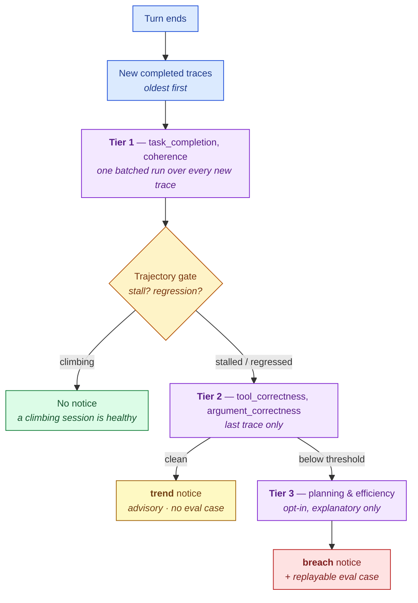

The harness scores your agent **as it works** — one trace per turn — and escalates only when the shape of the trajectory says something is actually wrong. This page is the detection engine: what gets measured, what counts as a failure, and when the agent finds out.

<Note>
  **Why the trajectory and not a threshold?** A single score compared against a fixed floor is a weak trigger for an agent mid-task: early in any real task the work genuinely *is* incomplete, so a low score is correct rather than a fault. Judging the series instead — is it climbing, stalled, or falling back? — separates an agent making progress from one that is stuck, which a point comparison cannot do.
</Note>

## The three tiers

Evaluation is a ladder. Cheap, always-on signals watch progress; expensive, surgical signals run only once the cheap ones say something is wrong.

| Tier | Metrics | Runs on | Breaches on |
| --- | --- | --- | --- |
| **1** | `task_completion`, `coherence` | **Every** new trace, every turn | Trajectory shape only — a stall or a regression |
| **2** | `tool_correctness`, `argument_correctness` | The **last trace only**, and only once Tier 1 breaches | Its absolute threshold |
| **3** | `plan_adherence`, `plan_quality`, `step_efficiency` | The last trace, only once Tier 2 **confirms** — opt-in via `enable_tier3` | Never |



Tier 1 is deliberately cheap: `task_completion` is the outcome trajectory and `coherence` is an embedding-based (free) co-gate. Tier 3 is opt-in because every LLM-judge metric reads the whole trace, so cost scales with metric count.

<Note>
  These are the metrics the platform reports as runnable via `pandaprobe evals metrics --target trace`. The set is configurable per tier if your project defines its own metrics.
</Note>

## The trajectory gate

A Tier-1 metric does **not** breach on its absolute value. An agent three steps into a task has legitimately not completed it, so a low early `task_completion` is expected, not a fault. What matters is the *shape* of the series:

<AccordionGroup>
  <Accordion title="STALL — no progress toward the target" icon="pause">
    `gate_window` consecutive traces (default `5`) pass without a new high, **and** the session's best score so far is still below `gate_target` (default `0.5`). The agent is working but not getting closer to done.

    Note it is the *peak* that is compared against `gate_target`, not the latest score: once a session has genuinely reached the target, a later flat stretch is not a stall.
  </Accordion>
  <Accordion title="REGRESSION — a fall from the running peak" icon="trending-down">
    The score drops more than `gate_drop` (default `0.15`) below the best value this session has reached. The agent had it and lost it. This one applies regardless of `gate_target`.
  </Accordion>
  <Accordion title="RESET ON GAIN — the healthy case" icon="trending-up">
    A score reaching `peak + gate_gain` (default `+0.02`) raises the peak and resets the window to zero. **A session that keeps improving never breaches**, no matter how low it starts or how long it takes.

    Progress is measured against the **peak**, not the previous trace — so oscillating around a plateau does not read as progress.
  </Accordion>
</AccordionGroup>

The gate **fires once and then starts a fresh window**, so one stall produces one escalation rather than one per subsequent trace. Its state — the running peak and the stall counter — lives alongside the score series in `state/score_history.json`, so it survives process restarts, and a whole trace's metrics fold into it in a single write.

<Tip>
  **`gate_window` is the primary knob.** Lower it to catch stalls sooner at the cost of more escalations; raise it to give long-horizon tasks more room. `HARNESS_GATE_WINDOW` is the one gate knob exposed as an environment variable for exactly this reason.
</Tip>

## Which tiers can breach on a value

Only tiers **0** and **2** treat "below threshold" as a finding:

| Tier | Absolute breach? | Why |
| --- | --- | --- |
| **0** — the [verifier](/harness/closed-loop/outcome-verifier) outcome | Yes | A low value *is* the finding — a verifier's verdict is ground truth, not an estimate. |
| **1** — trajectory metrics | **No** | Its verdict is `stalled` / `regressed`. Treating the floor as a breach is the point-threshold behavior the trajectory gate exists to replace. |
| **2** — step-level metrics | Yes | This is the surgical diagnosis: which step was actually wrong. |
| **3** — planning metrics | **No** | Tier 3 only ever runs to *explain* a confirmed Tier-2 breach, so it must never be a breach source of its own. |

## Severity: advisory vs. actionable

The mapping is deliberate, because it decides what becomes a promotable training signal:

| Outcome | Severity | Eval case captured? |
| --- | --- | --- |
| Tier 1 fires, Tier 2 comes back clean | `trend` — advisory | No |
| Tier 2 confirms a below-threshold step | `breach` | **Yes** (with `capture_eval_cases`) |
| The circuit breaker tripped | `needs_human` | No |

Only a **confirmed, surgically-diagnosed** failure becomes a replayable [eval case](/harness/closed-loop/eval-set-and-replay). A trajectory wobble the step-level metrics can't corroborate is worth telling the agent about, but not worth training on.

## Conditions and signatures

Every condition a score satisfies becomes a label, and a **signature** is `condition:metric`:

| Condition | Fires when |
| --- | --- |
| `stall` | The trajectory gate saw no gain across the window. |
| `regression` | The score fell `gate_drop` from the running peak. |
| `breach` | The score is below its threshold *and* its tier breaches on absolute value. |

So `stall:task_completion` and `breach:tool_correctness` are signatures. They drive de-duplication, rule tagging, eval-case matching, and forward-trial baselines throughout the harness.

## How a turn is scored

```bash
# 1. Discover this turn's new traces (oldest first, per-session seen-set)
pandaprobe traces list --session-id <id> --status COMPLETED \
    --sort-by started_at --sort-order desc --limit 50

# 2. Tier 1 — ONE batched run covering every new trace
pandaprobe evals runs batch --target trace --trace-ids <t1>,<t2>,<t3> \
    --metrics task_completion,coherence
pandaprobe evals runs scores <run_id> --target trace   # polled until terminal

# 3. Tier 2 — only if the gate opened, and only on the last trace
pandaprobe evals runs batch --target trace --trace-ids <t3> \
    --metrics tool_correctness,argument_correctness
```

- **One platform run per turn** for Tier 1, however many traces landed — the batch endpoint takes every id at once and tags each score with its trace. The gate's fold is still applied one trace at a time in chronological order, because a peak/stall fold is history-dependent; only the *evals* are batched.
- Polling is bounded by `poll_interval_s` × `poll_max_attempts`.
- Trace ingestion lags turn-end (the SDK flushes on a background thread), so transiently empty runs are retried with backoff (`eval_retry_attempts`, `eval_retry_backoff_s`). An **empty trace listing is only retried while the session has never yet produced a trace** — once one has landed, an empty listing is the truth, and retrying it would sleep out the backoff budget on every healthy turn with nothing new to score.
- Any persistent CLI failure degrades to a **pending** score. A pending score is never a breach, and the harness never raises into, or blocks, your agent loop.

<Note>
  Before the first evaluation, a memoized **health check** verifies the CLI is present and authenticated (`pandaprobe version` + `auth status`). On failure the harness runs *degraded*: one warning, a journal `health` event, evaluations skipped — never a crash, never a silent no-op.
</Note>

## The per-turn barrier

Detection is worthless if the lesson arrives after the task is over. `harness.settle(session_id)` blocks until this turn's diagnosis has landed — the evaluation resolved, the report handled, the eval case captured, the notice posted — so the agent's **next** turn sees the mailbox and rule set the harness just produced:

```python
async with harness.turn(session_id, settle=True):
    await my_agent_step(...)
```

```python
result = await harness.settle(session_id)
result.report      # EvalReport | None — this turn's diagnosis
result.alerting    # did anything fire?
result.timed_out   # budget expired; work continues detached
```

The barrier runs on its own generous `barrier_timeout_s` (default `180s`), deliberately separate from `drain_timeout_s`, which is only a best-effort join. On expiry the work stays running detached and `timed_out` is set: a slow platform degrades the loop's **latency**, never its correctness.

<Warning>
  The barrier is also the precondition for the trajectory gate having a series at all. Score history is keyed per session, so a host that hooks the harness once per *task* gives every series exactly one sample — the gate can never reach `gate_window` and the whole trend machinery is inert. Settle **per turn**, not per task.
</Warning>

`hook.pending_sessions` exposes which sessions still have work in flight, for host-side phase barriers ("has everything landed before I archive the workspace?").

## De-duplication, cooldown, and recovery

A persistent problem should post **one** notice, not one per turn:

- Per session, the harness remembers the last posted signature set. A new notice posts only when a **new condition** appears — or, with `alert_cooldown_turns > 0`, when the cooldown expires while the same conditions persist.
- When a previously-alerting session scores clean, the state resets and a `recovery` event is journaled. A later regression of the same kind alerts again.

## The circuit breaker

If something goes systemically wrong — a bad deploy, a broken tool — notices can storm. More than `circuit_breaker_max_notices` within `circuit_breaker_window_s` escalates to a single **`needs_human`** notice and suppresses further posting until the window drains. The standing protocol instructs the agent to surface that notice to a human rather than act on it: it is the one deliberate exit from the autonomous loop.

## Shadow mode

`observe_only=true` evaluates and journals everything but never posts to the mailbox — useful for tuning the gate against real traffic before letting the agent act. Pair it with the [calibration CLI](/harness/closed-loop/calibration).
